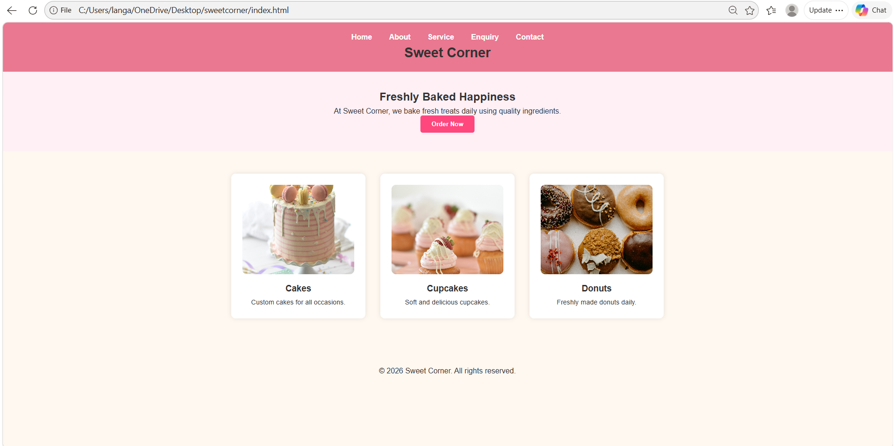
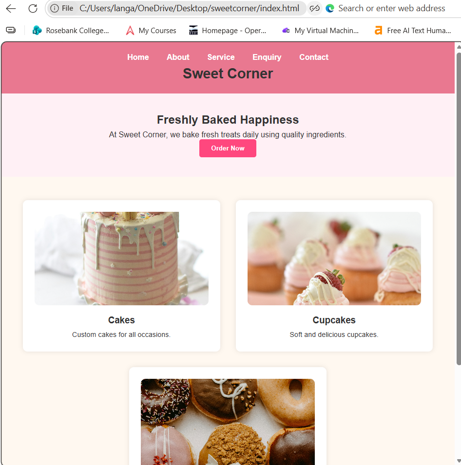
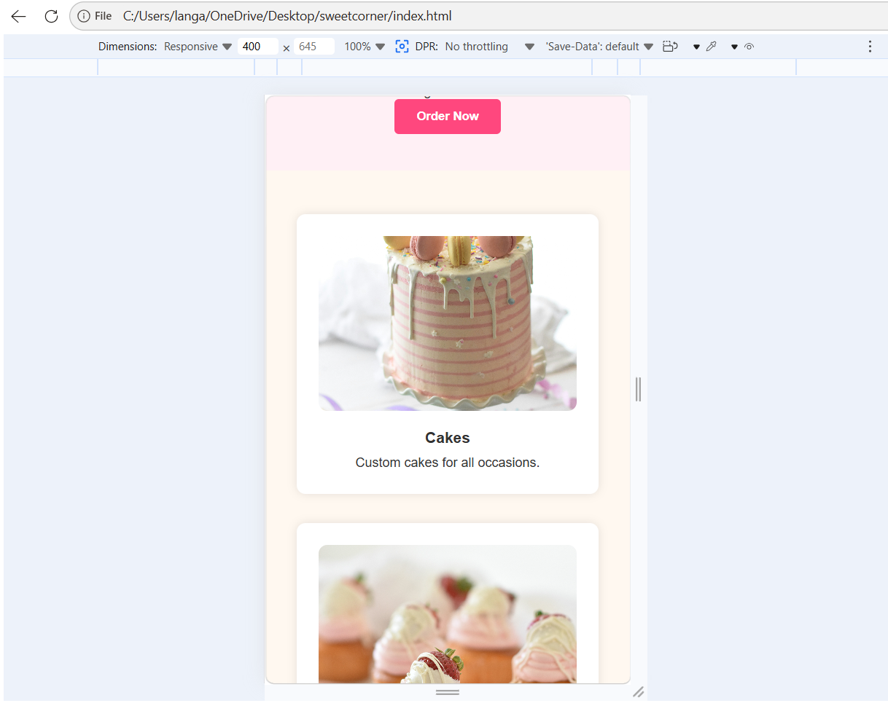

# Sweet Corner Website

## Project Overview
Sweet Corner is a responsive bakery website designed to showcase products and services, and allow customers to make enquiries online. The website provides an easy-to-use interface for browsing baked goods and contacting the business.

---

## Website Pages
- Home (index.html)
- About (about.html)
- Services (service.html)
- Enquiry (enquiry.html)
- Contact (contact.html)

---

## Features and Functionality
- Responsive design for mobile, tablet, and desktop devices
- Navigation across all pages
- Product display with images
- Enquiry form with validation
- Contact form for customer messages
- JavaScript interaction (alerts and validation)
- Google Maps integration on the contact page
- Styled using CSS (Flexbox layout and card design)
- Hover effects and smooth transitions

---

## Technologies Used
- HTML
- CSS
- JavaScript

---

## Budget
The estimated cost for developing and maintaining the Sweet Corner website is based on realistic business requirements:

- Domain Registration: R150 per year
- Web Hosting: R100 per month (R1200 per year)
- Development Costs: Approximately R3000 (once-off)
- Images and Assets: Free (Unsplash)

**Total Estimated Cost (First Year): R4350**

---

## Changelog

### Part 1 Improvements
- Expanded About page content for better detail
- Improved Services page descriptions
- Added alt text to all images
- Improved overall content depth and readability

### Part 2 Updates
- Created external CSS stylesheet
- Applied responsive design using Flexbox and media queries
- Added tablet and mobile breakpoints
- Improved layout, spacing, and typography
- Added hover effects and transitions
- Styled forms for better usability
- Integrated Google Maps on Contact page

---

## Screenshots

### Desktop View

### Tablet View

### Mobile View

---

## References
- Unsplash – https://unsplash.com
- W3Schools – https://www.w3schools.com
- MDN Web Docs – https://developer.mozilla.org

---

## Author
Sweet Corner Website Project